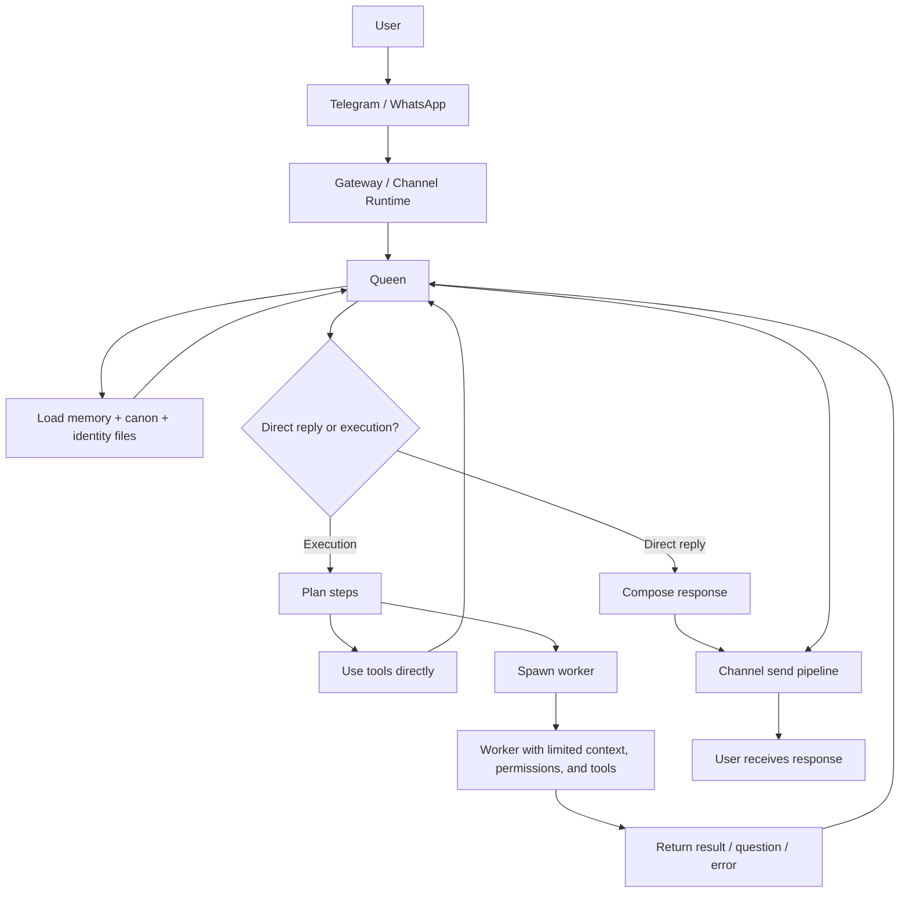

<p align="center">

</p>

<p align="center">
  <strong>RUN YOUR OWN AI HIVE, FAST AND SECURE!</strong>
</p>

BroodMind is a local AI orchestration system built around a **Queen + Workers** architecture.
It runs on your device or server and acts as a long-running AI operator that plans tasks, spawns workers, and executes workflows on your behalf.

The **Queen** is the long-running coordinator: it holds memory, plans work, chooses tools, manages context, and delegates execution.
**Workers** are short-lived specialists with limited permissions, bounded context, and task-specific tool access.

BroodMind is designed for persistent assistant workflows, not just single prompts. It combines conversation channels, reusable workers, scheduling, memory, canon, policy controls, and an ops dashboard into one local system you can run on your own machine or server.

This separation improves safety and reliability: sensitive context stays with the Queen, while workers receive only the minimum context needed to complete a task.

## Core Architecture



It is designed for long-running assistant workflows, with memory, scheduling, and operational guardrails.
The Queen, which holds all system context and sensitive data, never communicates with the outside world on its own. Instead, the Queen delegates tasks to workers with limited context and predefined tool/skill sets. Workers can spawn subworkers for multi-step tasks. Workers can only return response of their tasks or question/error responses. 
This design improves data security, reduces context leakage, and protects the system from prompt injection attacks.

## What It Can Do

- Run as a persistent AI operator over Telegram or WhatsApp
- Plan work and delegate tasks to specialized workers
- Execute filesystem, web, browser, shell, and MCP tools  under policy controls
- Create and reuse worker templates, MCP server connections, and skills([SKILL.md](https://agentskills.io/home))
- Maintain persistent memory, canon, and user/system identity files
- Monitor context health and trigger structured context resets when needed
- Schedule recurring tasks and background routines
- Expose a private gateway and dashboard for status, workers, and system visibility
- A set of canonical memory files shapes the system environment:
  - **MEMORY.md** – working memory and durable context; important facts, current state, and notes the system may need across sessions
  - **memory/canon/** – curated long-term knowledge that has been reviewed and promoted into trusted reference material
  - **USER.md** – user profile, preferences, habits, and interaction style
  - **SOUL.md** – system identity, values, tone, and core behavioral principles
  - **HEARTBEAT.md** – recurring duties, monitoring loops, schedules, and background obligations

## Quick Start

### 1. Prerequisites

- Python 3.12+
- `uv` (recommended)
- Node 20+ for web ui 
- One user channel:
  Telegram bot token from [@BotFather](https://t.me/botfather), or
  WhatsApp Web linking via QR
- Bring your own LLM API key:
  OpenRouter, OpenAI, Anthropic, Google Gemini, Mistral AI, Together AI, Groq, Z.ai, Custom OpenAI-compatible, Ollama

Install `uv` if needed:

```bash
# macOS/Linux
curl -LsSf https://astral.sh/uv/install.sh | sh
```

```powershell
# Windows PowerShell
powershell -ExecutionPolicy ByPass -c "irm https://astral.sh/uv/install.ps1 | iex"
```

### 2. Bootstrap script

```bash
git clone https://github.com/pmbstyle/BroodMind.git
cd BroodMind
```

```bash
# macOS/Linux
chmod +x ./scripts/bootstrap.sh
./scripts/bootstrap.sh
```

```powershell
# Windows PowerShell
./scripts/bootstrap.ps1
```

This is the main starting path. The bootstrap script installs dependencies, installs Playwright Chromium, and then launches `broodmind configure`.

### 3. Open the web dashboard

After bootstrap, start BroodMind and then open the dashboard in your browser:

```bash
uv run broodmind start
```

Open [http://127.0.0.1:8001/dashboard](http://127.0.0.1:8001/dashboard) (change IP to your instance)

If you enabled dashboard protection during `broodmind configure`, use the value of `BROODMIND_DASHBOARD_TOKEN` from `.env` when the dashboard or dashboard API asks for it.

If the page says the dashboard is unavailable, build and enable the web app first:

```bash
cd webapp
npm run build
```

Then set `BROODMIND_WEBAPP_ENABLED=1` in `.env` and start BroodMind again.


### 4. Manual setup

If you do not want the bootstrap script, use the manual path below.

```bash
git clone https://github.com/pmbstyle/BroodMind.git
cd BroodMind
uv sync
uv run broodmind configure
```

Alternative without `uv`:

```bash
python -m venv .venv
# Windows
.venv\Scripts\activate
# macOS/Linux
source .venv/bin/activate
pip install -e .
```

Then run:

```bash
broodmind configure
```

`configure` creates/updates `.env` and bootstraps workspace files if missing.

### 5. Start

```bash
# background mode
uv run broodmind start

# foreground mode
uv run broodmind start --foreground
```

### 6. Check Health

```bash
uv run broodmind status
uv run broodmind logs --follow
```

## Core Commands

```bash
# lifecycle
uv run broodmind start
uv run broodmind stop
uv run broodmind restart
uv run broodmind status
uv run broodmind logs --follow

# gateway/dashboard
uv run broodmind gateway
uv run broodmind dashboard
uv run broodmind dashboard --watch

# worker templates
uv run broodmind sync-worker-templates
uv run broodmind sync-worker-templates --overwrite

# memory maintenance
uv run broodmind memory stats
uv run broodmind memory cleanup --dry-run
```

## Optional: Docker Worker Launcher

Default runtime is non-Docker. If you want Dockerized workers:

```bash
uv run broodmind build-worker-image --tag broodmind-worker:latest
```

Then set in `.env`:

```env
BROODMIND_WORKER_LAUNCHER=docker
BROODMIND_WORKER_DOCKER_IMAGE=broodmind-worker:latest
```

Restart BroodMind after config changes.

## Troubleshooting

### Telegram bot starts but does not reply

- Verify `TELEGRAM_BOT_TOKEN`
- Verify your chat ID is in `ALLOWED_TELEGRAM_CHAT_IDS`
- Check `uv run broodmind status` and `uv run broodmind logs --follow`

### WhatsApp is selected, but not receiving messages

- Verify `BROODMIND_USER_CHANNEL=whatsapp`
- Verify your phone number is in `ALLOWED_WHATSAPP_NUMBERS`
- Run `uv run broodmind whatsapp install-bridge`
- Run `uv run broodmind whatsapp link`
- Start BroodMind again and check `uv run broodmind whatsapp status`

### LLM errors

- Run `uv run broodmind configure` and pick the provider you want to use.
- For unified LiteLLM config: set `BROODMIND_LITELLM_PROVIDER_ID`, `BROODMIND_LITELLM_MODEL`, and `BROODMIND_LITELLM_API_KEY`.
- Existing `ZAI_*` and `OPENROUTER_*` variables still work as legacy fallbacks.

### Web search/fetch issues

- Add `BRAVE_API_KEY` for `web_search`
- Add `FIRECRAWL_API_KEY` for richer page extraction

